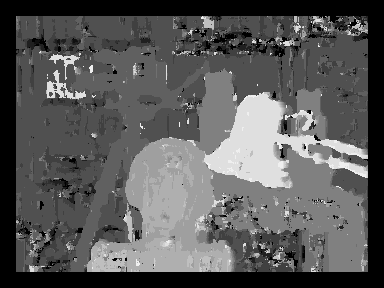
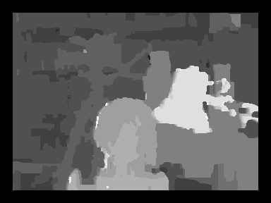

# StereoVision_Markov_Random_Fields
Use Markov Random Fields to improve the basic stereo block matching algorithm

## Basic stereo block-matching algorithm

## Belief propagation with Markov random fields

